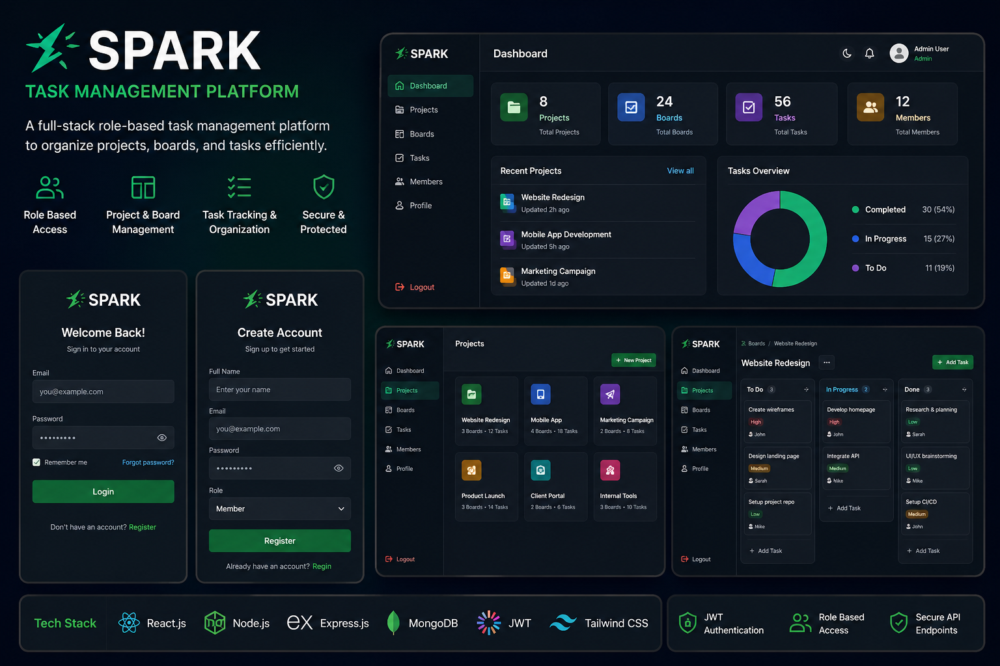
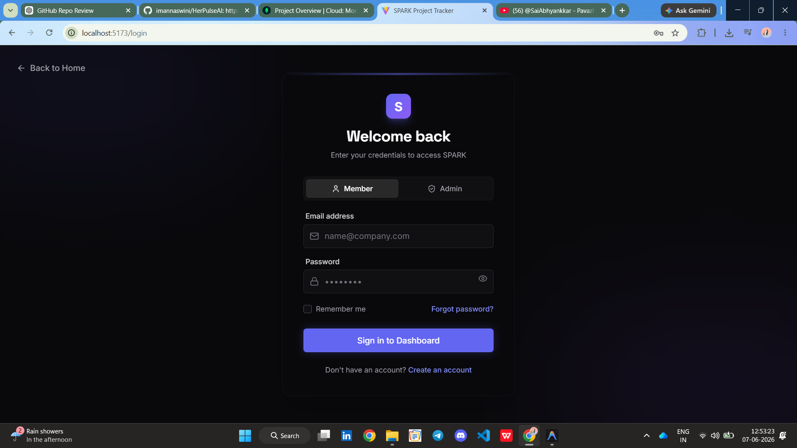
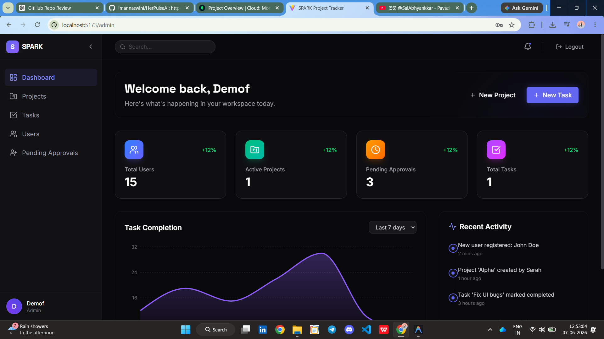
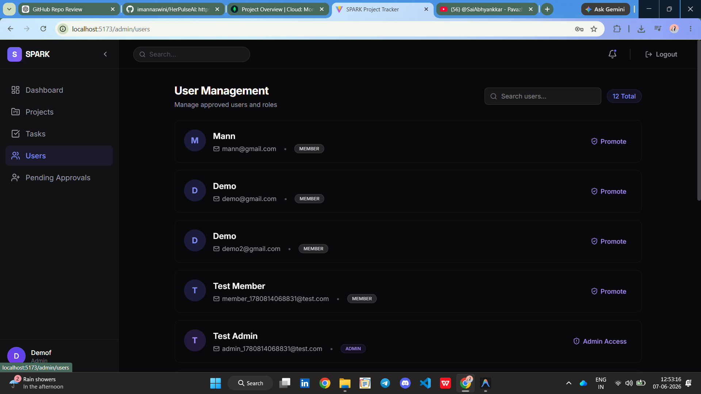
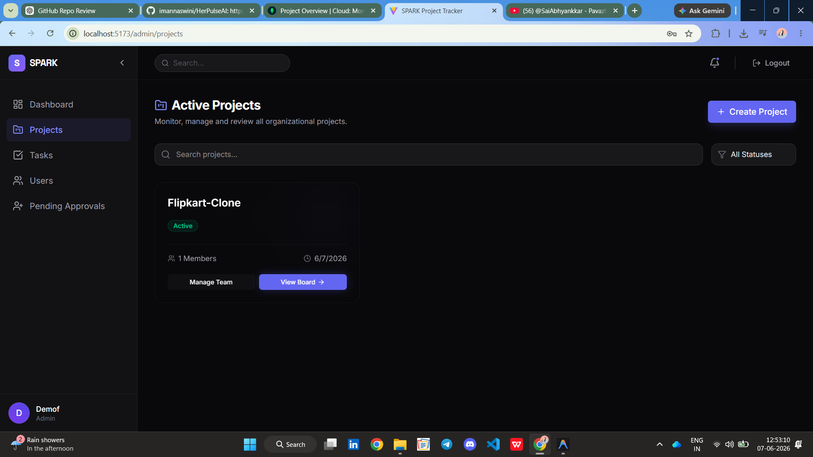
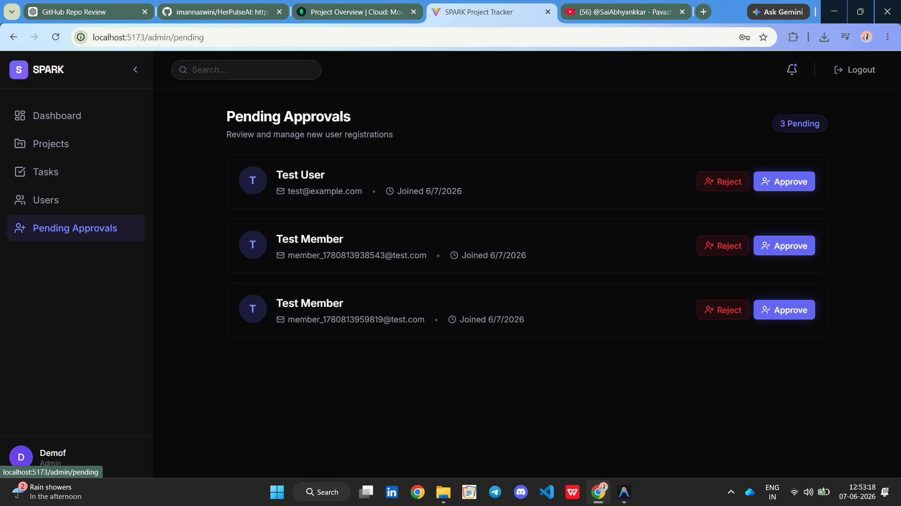
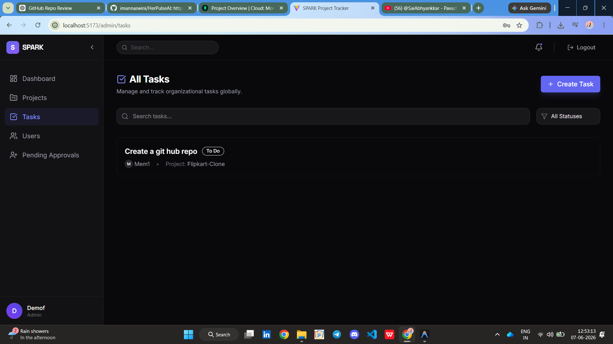
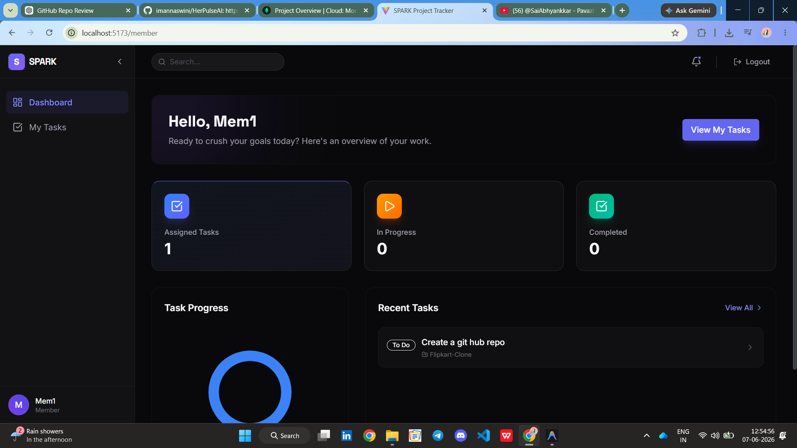
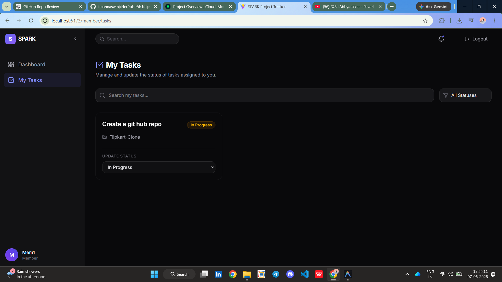

# SPARK – Task Management Platform (Trello Clone)

SPARK is a **full-stack task management platform inspired by Trello** that helps teams organize tasks using an interactive Kanban-style board.

The platform allows users to **create, manage, and track tasks across different stages of a project**, improving productivity and collaboration.



---

## 🚀 Key Features

- **Task Management**: Create, update, and delete tasks easily.
- **Kanban Board**: Interactive Kanban-style task board for workflow management.
- **Role-Based Access**: Specialized dashboards for Admin and Member roles.
- **Secure Authentication**: Robust secure authentication using JWT.
- **Organized Workflow**: Manage tasks using status columns (To Do, In Progress, Completed).
- **Modern UI**: Clean, responsive, and dynamic user interface design.

---

## 💻 Tech Stack

| Layer | Technology |
|------|------------|
| **Frontend** | React.js |
| **Backend** | Node.js, Express.js |
| **Database** | MongoDB |
| **Authentication** | JWT |
| **Tools** | Git, GitHub, VS Code |

---

## 📂 Project Structure

```text
TrelloClone
│
├── frontend
│   ├── components
│   ├── pages
│   └── styles
│
├── backend
│   ├── models
│   ├── routes
│   └── controllers
│
└── README.md
```

---

## 📖 Overview

SPARK is designed to simplify **project and task management** by providing an intuitive Kanban-style interface similar to Trello.

Users can manage tasks across multiple stages:
- **To Do**
- **In Progress**
- **Completed**

This visual workflow helps teams **track progress efficiently and manage projects more effectively**.

---

## 📸 Screenshots

Here is a glimpse of the different views and components available in SPARK. *(Note: Ensure the images are placed in a `screenshots` folder in the root directory)*

### 🔐 Authentication


### 👑 Admin Views






### 👤 Member Views



---

## ⚙️ Installation and Setup

**1. Clone the repository:**
```bash
git clone https://github.com/imannaswini/TrelloClone.git
```

**2. Navigate to the project folder:**
```bash
cd TrelloClone
```

**3. Install dependencies (Root, Frontend, Backend):**
```bash
# Run this inside the backend directory
cd backend
npm install

# Run this inside the frontend directory
cd ../frontend
npm install
```

**4. Run backend server:**
```bash
cd ../backend
node server.js
```

**5. Run frontend:**
```bash
cd ../frontend
npm start
# or npm run dev depending on your package.json
```

**6. Open the application in browser:**
```text
http://localhost:3000
```

---

## 🔌 API Overview

Example backend endpoints:

| Method | Endpoint | Description |
|------|---------|-------------|
| `POST` | `/api/signup` | Register new user |
| `POST` | `/api/login` | User authentication |
| `GET` | `/api/tasks` | Fetch tasks |
| `POST` | `/api/tasks` | Create new task |
| `PUT` | `/api/tasks/:id` | Update task |
| `DELETE` | `/api/tasks/:id` | Delete task |

---

## 🔮 Future Improvements

- [ ] Real-time collaboration
- [ ] Drag-and-drop task cards
- [ ] Task deadlines and notifications
- [ ] Team collaboration features
- [ ] Cloud deployment

---

## 👤 Author

**Mannaswini P A**

- **GitHub:** [imannaswini](https://github.com/imannaswini)
- **LinkedIn:** [mannaswini](https://www.linkedin.com/in/mannaswini)
